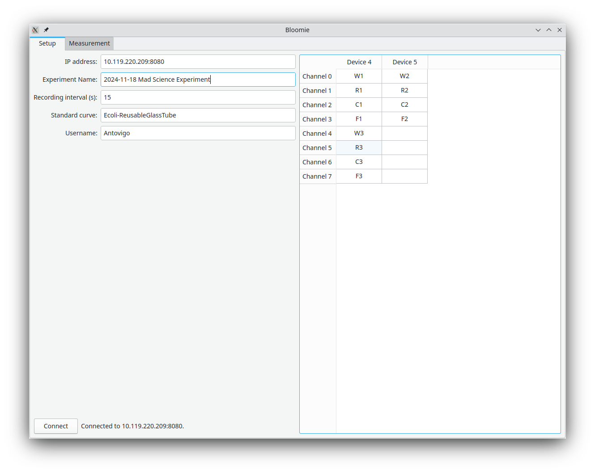
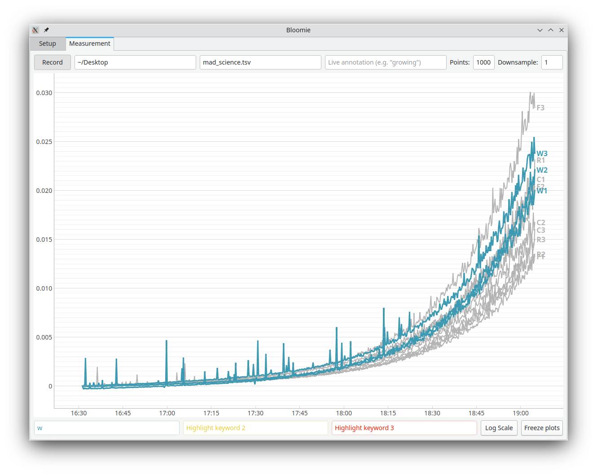

# Bloomie

|  |  |

## Dependencies

Install the python dependencies:

```bash
pip install iso8601 PyQt5 pyqtgraph
```

## Configuration

To adjust parameters, copy the `default_config` file to `~/.config/bloomie.yaml`.
You can also run without a config file, in which in case the default parameters will be used – but you will probably want to change the default IP address so it matches your device.

## Usage

First, start the backend on the OD readers' host computer:
```bash
./odmeter_ctrl
```
(This can be done over ssh. In general, it is good practice to always start a fresh instance of the backend, then start Bloomie, and if you need to restart the measurement, just restart everything from the beginning.)

Then, start the frontend from your computer:

```bash
python3 main.py
```

It will automatically try to connect to the default IP address specified in your configuration file.
Otherwise, specify the IP address you want and click "Connect". If the connection fails, it might be that the backend is not running.

### Setup samples

Then, on the right, you can add labels to your samples. 

To skip recording a channel, simply erase its name. If you don't want the table to be automatically filled with placeholders, disable the `use_placeholder_names` option in the configuration file.

Note that the cells can be copy and pasted freely to text files or the Excel.

You can also adjust a few settings about your experiment – in particular, set up how often you want to take timepoints.

### Start measurement

Now, switch to the "Measurement" tab. Click on "Record" to start recording data to the file of your choice.
During recording, the data is saved continuously to the file.

The **Freeze plots** button allows you to stop updating the plots so you can inspect the data more closely. It does *not* interrupt data acquisition, just plotting.

You can use the **Live annotations** field to add context to your data. Whatever you write in this field will be saved in the Tab-separated file as an additional column.
For example, if you first measure your tubes with only media in them as a blank, you could write "Blank". Then, while you are inoculating the cells, write "Inoculating" in the field. Finally, once inoculation is done, write "Growing". This will make it easy to extract the different phases during the analysis.

Use the **Highlight** fields to highlight specific samples in the plots. Any sample whose name contains the highlight keyword will appear in a different color. 
You can also use `*` as a wild-card, matching any substring.
This is case-insensitive. 
Note that you can change the number of highlighting fields by adding more colors in the `highlight_colors` list in the config file. (I have not tested that.)

To speed up the plotting, you can change the number of points:

With the **Points** field you can set the (maximal) number of points to be displayed – then, only the last N points will be shown.
The **downsample** field allow you to show only one point out of N.
For example, if you have 5000 points and the maximum is set to 1000, you can either see the last 1000 points (by setting "downsample" to 1), or see everything but skipping 4/5 points (by setting "downsample" to 5).

### Stop measurement

When you are done, click on "Record" again to stop recording data. You can also straight up close the window. It should be fine too. It's probably a good idea to restart the software whenever you make a new experiment anyways.

